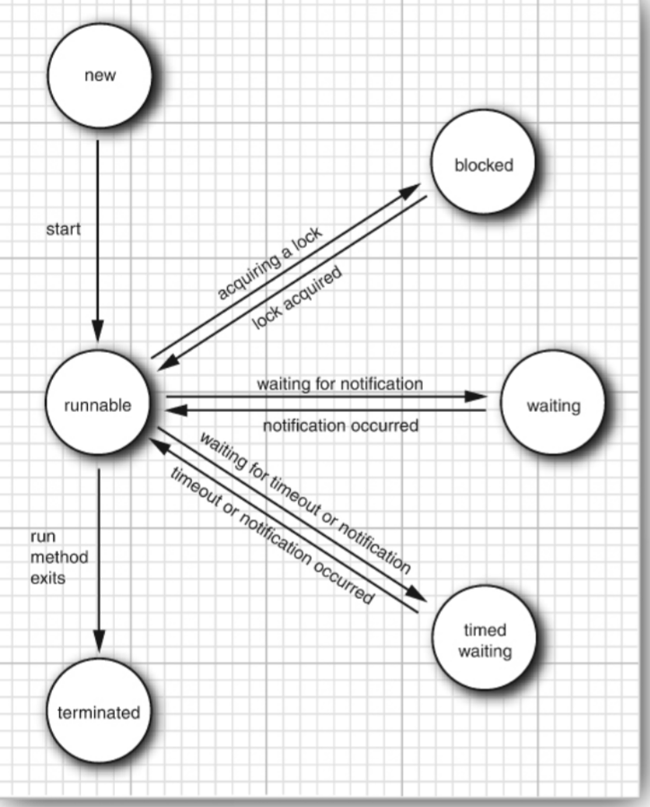

# java核心技术 12th 卷1  第十二章笔记 并发性
<font color = "red">进程有独立的资源；一个进程的线程共用该进程的数据</font>
## 12.1 什么是线程
1. 创立一个线程：
   ```
   Runnable r = ()->{
        // the task 
   };
   var t = new Thread(r);
   t.start();
   ```

## 12.2 线程状态
1. 线程的六大状态:**New, Runnable, Block, Wait, Timed Waiting, Terminated**
   + `New`：`var t = new Thread(r)`后, `t.start()`之前。
   + `Runnable`。在调用`t.start()`之后。**Runnable下线程可能没有实际运行，操作系统没有调度到它。这种情况也算在Runnable内。** 操作系统中就绪队列中的线程也处于`Runnable`状态。
   + `Block`， 线程没有竞争到同步锁(除了*java.util.concurrent*中的锁)而暂停。
   + `Wait`，线程等待其它线程的特定动作或某些外部条件发生而处于暂停。可以由`Object.wait`,`Thread.join`,`java.util.concurrent`导致。
   + `Timed waiting`线程处于暂停状态，等待一段时间后恢复正常。
   + `Terminated`，线程正常运行结束，或者出现了异常。`stop`被遗弃了，不应该被使用。

   线程各状态转换如图所示：
   

## 12.3 线程属性
1. `threadObj.interrupt()`可以将一个线程设置为中断状态。通过`threadObj.isInterrupted()`来检查一个线程是否被设置为中断状态。如果`threadObj.interrupt()`中的线程对象处于阻塞状态时，线程无法检查自己的中断状态，这时候`isInterrupted()`会触发`InterruptedException`异常。
2. <font color = "red">Java中的中断不同于计算机组成原理中的硬件中断。</font>**Java中的中断更多是其它线程向本线程传递的一个信号。如果线程A完全忽略中断状态，线程B中断线程A不会对线程A产生任何影响。**
3. <font color = "red">`run`中抛出的异常需要在`run`中解决。线程T的创建者无法捕获线程T的异常。</font>
4. 设置守护线程，在`t.start`之前设置`t.setDaemon(true)`。守护线程主要为用户线程提供服务，例如计时器和垃圾回收。<font color = "red">只剩下守护线程时，虚拟机会结束运行。</font>
5. `t.setName("threadName")`为线程设置名字，在线程转储中会很有用, **可以在thread.start()之后**
6. 可以使用`thread.setUncaughtExceptionHandler(handler)`来为线程添加未处理异常的处理。其中`handler`是实现`Thread.UncaughtExceptionHandler`接口的一个类对象。
   ```
   public class MyUncaughtExceptionHandler implements Thread.UncaughtExceptionHandler {
      @Override
      public void uncaughtException(Thread t, Throwable e) {
         System.out.printf("线程 %s 因异常终止：%s%n", t.getName(), e);
      }
   }

   // 使用示例：
   Thread thread = new Thread(() -> {
      // 模拟引发非受检异常的任务
      throw new RuntimeException("出了点问题");
   });

   thread.setUncaughtExceptionHandler(new MyUncaughtExceptionHandler());
   thread.start();
   ```
   <font color = "red">需要注意的是，即使使用了setUncaughtExceptionHandler了，出错的线程仍然会终止。</font>
   `ThreadGroup`实现了`Thread.UncaughtExceptionHandler`接口。
7. 线程的优先级。线程的优先级默认和它的父线程相同。<font color = "red">优先级为1到10，数字越大，优先级越高。</font>Java线程的优先级会映射到宿主机操作系统的线程优先级上。<font color = "red">现在Java使用操作系统的线程，不应该使用Java自己的线程优先级了。</font>
   

## 12.4 同步
1. 多个线程同时修改，导致数据不一致。示例：[银行账户余额转移](./../Chapter12/RaceCondition/BankTest.java)。冲突原因同操作系统中的一样，`a += 1`实际是
   ```
   mov r1 a
   add r1 1  // 在这被其它线程抢占了
   mov a r1
   ```
2. 可以使用`synchronized`和` ReentrantLock`来进行同步。
3. 使用`ReentrantLock`来实现同步：
   ```
   private Lock mutexLock = new ReentrantLock();
   ...
   mutexLock.lock();
   ... // critical section，临界区
   mutexLock.unlock();
   ```
   `ReentrantLock`声明的`Lock`对象默认是**互斥锁**。**Lock不能放进`try-with-resources`中自动释放。**<font color = "red">ReentrantLock采取记数的方式。lock()，记数+1；unlock(), 记数-1。只有当记数为0的时候才会释放锁。</font>**本质上ReentrantLock就是信号量的机制，与C++中的shared_ptr的计数类似。**
4. **出现异常可能会跳过临界区的部分代码，需要重点关注。**<font color = "red">需要有`finally`来释放锁。</font>
5. `Condition Objects`，条件对象。**线程获得锁进入临界区，但是某些条件没有满足。释放锁进入wait状态，等待条件的满足**。条件对象是绑定在锁上的，声明如下：
   ```
   ReentrantLock lock = new ReentrantLock();
   Condition conditionObj = lock.newCondition();
   ```
   `conditionObj.await()`，使当前线程进入`wait`状态。<font color = "red">await()是直接释放锁，而unlock()是计数-1，两者不同。</font>

   `conditionObj.await()`后，其它线程可以通过`conditionObj.signalAll()`来发出条件满足的信号。这时候所有由于`conditionObj.await()`进入wait的线程会进入`runnable`状态，如果某个线程能够获得锁则进入运行状态，直接从`await()`的地方开始执行。<font color = "red">由于singalAll()不一定满足本线程的条件，即使获得了锁后还要再判断是否满足条件，不满足还要重新await。</font>因此await往往是写在一个循环中。
   ```
   while(! condition is OK)
      conditionObj.await();
   ```
   在其它线程中，条件相关的变量发生了变化后，使用singalAll()。wait的线程通过循环判断此时的状态是否满足要求。不满足的话继续await()。
   
6. `synchronized`可以使用内部锁。<font color = "red">每个对象，类等都可以拥有内部锁。</font>使用`synchronized method`的时候
   (1) 自动对方法lock和unlock。整个方法都在临界区中。
   (2) 可重入，隐式维护计数器。一个线程中可以递归调用该方法。整个递归结束才会释放锁
   (3) 有一个默认的条件对象。通过`wait`、`notify`和`notifyAll`分别进行`await`、`signal`和`signalAll`
   <font color = "red">一个对象或者类中所有的synchronized method共用一个内部锁。如果synchronized method A 在执行，那么其它线程对于synchronized method B仍要等待内部锁释放。</font>对象级的synchronized和类级的synchronized不同，对象执行synchronized method的同时可以执行静态方法。
7. Java中，每个类都有一个`Class`对象， 这个对象用于描述这个类的基本信息。**Class类本身也有Class对象**。对于类，通过`.class`来获得这个`Class`对象的引用。对于对象，通过`.getClass()`来获取。例如
   ```
   class MyClass{};
   MyClass.class;

   MyClass obj = new MyClass();
   obj.getClass()
   ```
8. Lock/Condition都不建议，<font color = "red">block queue和stream是好东西</font>
9. `synchronized block`，一个同步的代码块，也会获得内部锁。
   ```
   synchronized (obj){
      critical area
   }
   ```
   <font color = "red">obj可以是ReentrantLock等对象，这种情况相当于自动在critical area 前后进行lock()和unlock()的操作。</font>

10. `monitor`是一种概念，没有专门的关键词，通过OOP的方式管理同步。`monitor`<font color = "red">提供了线程安全性</font>
    + 所有的字段都是private的，只能通过method进行修改
    + 每个对象有锁
    + 每个方法都是基于锁的
    + 锁可以绑定任意个条件对象
 
   普通对象也有内部锁，与`monitor`的区别主要如下：
   + 字段不强制为private
   + 方法不强制基于锁
   + 内部锁对客户可用


11. `volatile`可以让变量的修改对其它线程可见，禁止指令的重新排序。由于当代处理器，每个线程都有自己的高速缓存，变量的读取通过缓存的话，不同线程从同一个变量中读取的值可能不同。**volatile可以保证读取的时候，读到的是内存中最后修改的值。但是不保证读取，写入之间不被抢占。**
      + 通过从主存读取来保证变量修改时可见的。
      + `volatile`不是原子性的
      + 使用同步锁也能保证变量的修改对其它线程可见。通过**缓存一致性协议**和**内存屏障**。**缓存一致性协议**通过硬件保证线程修改变量，释放了锁后，这些修改在其它线程中是可见的。**内存屏障**确保指令不会被重新排序。
     
     <font color = "red">volatile和锁机制可以保证读取到的变量总是最新的。</font>


12. `atomic`包中提供了原子操作类。以`AtomicInteger`为例
    ```
    public static AtomicLong nextNumber = new AtomicLong();  // nextNumber is 0 by default 
    long id = nextNumber.incrementAndGet(); // incrementAndGet()是一个原子性的操作
    ```
 
13. **乐观锁**不会提前检测， 在提交的时候检测冲突。
**悲观锁**会提前加锁，保证临界区只只有一个线程。
   乐观锁适合读多写少，悲观锁适合写多读少。
14. <font color = "red">atomic的实现是基于乐观锁的。</font>
    `LongAdder`和`LongAccumulator`。`LongAdder`用于多个线程频繁求和的情况，设置了多个计数器，减少了计数器冲突的情况。`LongAccumulator`则是扩展了运算的方式，不一定是求和，可以指定其它操作类型。**LongAdder.increment()和LongAccumulator.accumulate()就已经进行了计算，并不是在`get()`阶段才计算**

15. `stop`和`suspend`被遗弃了。
   `stop`，由于其它线程无法掌握本线程的情况，很难在正确的时候stop。<font color = "red">使用`interrupt`中断线程A，线程A中断后自己进行相应处理，最终自我了结。</font>
   `suspend`不会让线程释放锁，这是`suspend`与`await`的主要区别。
   
16. `INSTANCE`不是Java中的关键词，用于指代**单例模式** 中的单例。
17. `ThreadLocal`为线程声明本地变量。使用如下
   ```
      ThreadLocal<T> variable = ThreadLocal.withInitial(()->{new T()})
      T localVar = variable.get()
   ```
   **ThreadLocal为每个线程创建的都是新的对象实例。当线程第一次访问ThreadLocal变量，为该线程创建独立的变量。如果线程从始至终都不访问ThreadLocal变量，则不会创建。**

## 12.5 线程安全集合
1. `blocking queue`。生产者消费者模型。`put-take`会阻塞线程, 被阻塞的线程会释放锁，行为是`conditional variable`，即在队列有空间并重新获得锁后直接从被阻塞的地方运行。被阻塞时`add-remove`会抛出异常，`peek-poll`会返回null。<font color = "red">block queue是一种消息队列</font>
2. `blocking queue`是**线程安全**，但**不是原子性的**。如果多个线程同时向一个block queue添加元素，可以通过**锁机制**保证线程是安全的。在`blocking queue`的两头，都可以有多个线程来进行生产/消费 。
相关示例程序可参考[BlockingQueue消息队列](./../Chapter12/BlockingQueue/MainThread.java)
1. `ConcurrentHashMap`，`ConcurrentSkipListMap`, `ConcurrentSkipListSet`, and `ConcurrentLinkedQueue`都是线程安全的。**意味着两个线程可以同时在两个不同的区域进行写操作。**。<font color = "orange">Java8之前是分段上锁，Java8及之后采用了CAS，乐观锁机制。</font>
   <br>`ConcurrentHashMap`中的`get`和`put`不是原子性的。
   ```
   Long oldValue = map.get(word);
   Long newValue = oldValue == null ? 1 : oldValue + 1;
   map.put(word, newValue); // ERROR--might not replace oldValue
   ```
   上述例子中在`get`后，其它线程可能抢占进行更新了。
   `ConcurrentHashMap`相比`HashMap`的线程安全性体现在**多个线程修改`ConcurrentHashMap`的时候，不会破坏数据的结构。** 使用`HashMap`时，如果多个线程同时进行修改，会导致该`HashMap`数据结构遭到破坏，不可用。
2. 通过`compute`进行**原子更新**。 `map.compute(word, (k, v) -> v == null ? 1 : v + 1);` 类似的，使用`merge`也可以完成原子操作。 
3. 在`ConcurrnetHashMap`上的批量操作有
   + search 对每个键值对使用一个过滤函数f，返回第一个f不为空的键值对
   + reduce 累积键值对
   + forEach 在每个键值对上作用函数

   作用在`key`,`value`,`key-value`和`Map.Entry`上。
   设置`并行阈值threshold`，当元素数量大于`threashold`时，采用并行策略。使用`Long.MAX_VALUE`采用单线程策略。其中`reduce`，`forEach`可以先进行过滤，然后再执行操作。示例如下：
   ```
      ConcurrentHashMap<String ,Integer> map = new ConcurrentHashMap<>();
      map.merge("one", 1(threshold),Integer::sum);
      map.putIfAbsent("two",2);

      Integer res = map.search(1,(k,v)->k.equals("three")?1:0);
      System.out.println(res);

      Integer len = map.reduce(1,(k,v)->v, Integer::sum);

      map.forEach(1,
          (k, v) -> k.equals("one") ? k + " -> " + v : null, // filter and transformer
          (s)-> System.out.println(s)); // the nulls are not passed to the consumer
   ```
4. `ConcurrentHashMap.<T>newKeySet()`生成多线程安全的`Set`
5. `CopyOnWriteArrayList`和`CopyOnWriteArraySet`在修改的时候会创建副本，不需要上锁，但是大量的副本会占用较多的内存。
6. `Arrays.parallelSort()`用于并行排序。`Arrays.parallelSetAll()`用于并行设置。`Arrays.parallelPrefix()`用于并行推导，例如求和。**并行的线程数目默认是由Java决定**。
7. `Vector`,`HashTable`是线程安全的，现在可以使用`synchronized`进行包装,
   ```
   List<E> synchArrayList = Collections.synchronizedList(new ArrayList<E>());
   Map<K, V> synchHashMap = Collections.synchronizedMap(new HashMap<K, V>());
   ```
   但是还是建议使用原生的`ConcurrentHashMap`
   

## 12.6 任务和线程池
1. 创建一个线程涉及到和操作系统交互，有一定代价。如果**项目中有很多短生命周期的线程，不该将每个任务映射到一个单独的线程。**<font color = "red">线程池为了减少线程创建和销毁的开销。</font>
2. `Runnable`的run()没有参数和返回值
   `Callable`的call()没有参数，有返回值。`Future`来保留异步计算的返回值。
   以下是一个简易的示例：
   ```
   Callable<Integer> task = ()->12;
   FutureTask<Integer> futureTask = new FutureTask<>(task);
   Thread subThread = new Thread(futureTask);
   subThread.start();
   try {
      Integer res = futureTask.get();
      System.out.println(res);
   }
   catch(Exception e){
   }
   finally{
   }
   ```
   `futureTask.get()` **会阻塞当前线程，直至获得目标线程的返回值**。
3. `Executors`，主要用于创建和管理线程池。
4. `newCachedThreadPool`, `newCachedThreadPool`, `newSingleThreadExecutor`返回`ThreadPoolExecutor`类，该类实现了`ExecutorService`的接口
5. `Future<T> excutor.submit(task)` 向线程池提交任务，返回`Future`对象。可以**判断是否结束、取消，获得返回值**。
   <br>使用线程的简单示例如下：
   ```
     Callable<Integer> task = ()->12;
     ExecutorService poolExecutor = Executors.newCachedThreadPool();
     Future<Integer> future = poolExecutor.submit(task);
     try{
         Integer res = future.get();
         System.out.println(res);
     }
     catch (Exception e){}
     finally {
         poolExecutor.shutdown(); // 线程池不再接收新的任务提交
     }
   ```
   `shutdown`后，已经提交的任务还会继续执行。但是线程池不再接收新的任务。当线程中线程中的所有任务都执行结束后，线程池销毁其中的所有线程。
6. `invokeAny`返回一个运行结束的任务的结果、`invokeAll`等待所有任务运行结束，返回所有结果。
7. `Fork/Join`采用**归并思想。**将一个大的任务拆分成许多小的任务，然后再组成一个大的任务。`A.join()`**暂停当前线程，等待线程A执行完毕后再继续执行当前的线程。**


## 12.7 异步计算
1. `CompleteableFuture`可以不用轮询等待计算结果。采用异步的方式计算结果。使用`CompletableFuture.supplyAsync`用于在另一个线程上执行异步任务。采用`f.whenConmplete((s,t)->{})`来处理其中`s`是计算结果，`t`是抛出的异常。
2. `CompleteableFuture`可以将任务拆分成流水线的机制。使用`thenApply`来形成流水线。`thenApply`中的回调函数只有返回`U`，`thenApply`会进行包装形成一个新的`CompletableFutre<U>`
`thenCompose`在回调函数中就需要返回`CompletableFuture<U>`。`thenAccept`不返回结果，**一般用于流水线的最后**。
3. <font color = orange>UI相关的直接跳</font>
   
## 12.8  进程
1. Java中，一个进程对应一个`main`函数
2. `ProcessBuilder`、`Process`用于其它进程管理。
3. `builder.inheritIO()`，指定新进程的`InputStreams`、`OutputStream`和`ErrorStream`
4. 通过`start()`来运行另外一个进程。`waitFor()`等待进程运行结束。
5. `ProcessHandle`来获取运行中的进程的信息。
