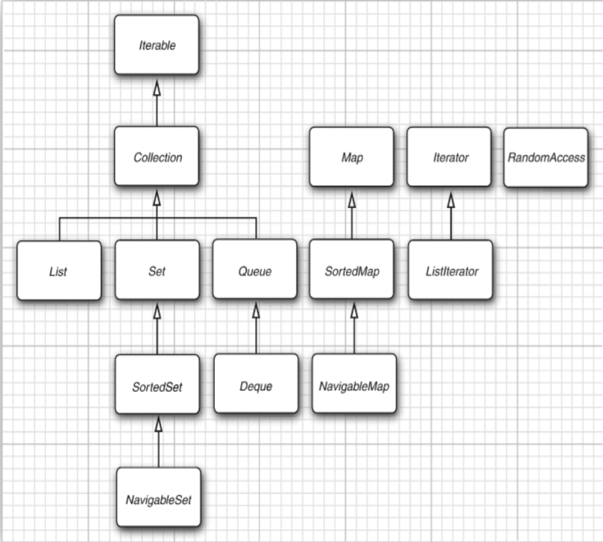
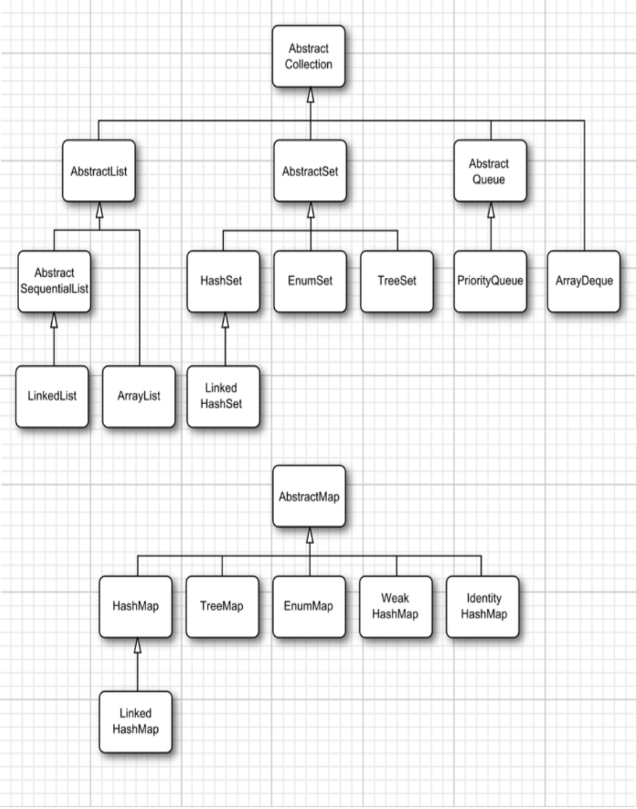

# java核心技术 12th 卷1  第九章笔记 集合
1. `Collection`是集合类的基本接口
2. `Iterator`，挺类似C++中的iterator。<font color = "red">`iterator`无法获取当前指向元素的值。`iter.next()`返回当前iter指向元素的值，同时将`iter`移动到下一个元素。</font>`Iterator`的基本用法
    ```
    List<Integer> myList=  new ArrayList<Integer>();
    Iterator<Integer> iter = myList.iterator();
    while(iter.hasNext()){
        ...
        var variable = iter.next();
    }
    ```
    也可以使用`for each`来简化
    ```
    for(var iter: myList){}
    ```
3. **Java中的`iterator`可以想象在元素之间。通过`next`，iterator会跨过一个元素，这个元素就是被访问的元素。** 
4. 默认`Iterator`不能从后往前遍历。可以
通过`ListIterator`来倒序遍历。
    ```
    ListIterator<String> listIterator = list.listIterator(list.size());
    while (listIterator.hasPrevious()) {
        String element = listIterator.previous();
        System.out.println(element);
    }
    ```
5. `AbstractCollection`没有那么多需要实现的抽象方法，适合自己开发。

## 9.2 集合框架中的接口
1. `Collection`中各个接口，如图9.2.1所示。
   

## 9.3 集合接口实现类
1. `Collection`中的实现类
   
2. `Collection`中的`add`方法默认是添加在末尾的。如果想在中间添加元素，可以通过`Iterator`。由于类似`Set`这种集合与顺序无关，因此`add`方法实现在了`Iterator`的子接口`ListIterator`中。`ListIterator.add`在当前指向元素的前面添加元素。、
3. `iterator.remove`<font color = "red">并不是删除`iterator`所指向的那个元素，而是最后一次`iterator.next()`返回的元素。对于`ListIterator.remove()`则是最后一次`next`或者`previous`的元素。</font>
4. `set`也类似`remove`，更改最后一个返回的元素。
5. Java中的`vector`是同步的。一般单线程用`ArrayList`就足够了。
6. `HashSet`是无序的，通过`HashTable`实现的；`TreeSet`是序的，通过**红黑树**实现的。
7. <font color = "red">优先队列本身并非是有序的，只是每次取出的元素是最小的/最大的</font>，取队列顶部元素最好使用`poll`

## 9.4 Map
1. 与`set`类似，有`HashMap`和`TreeMap`两种实现方式。`TreeMap`的`key`是有序的。
2. `forEach`遍历`Map`会比较好.
    ```
    var count = new HashMap<K, V>();
    count.forEach((K, V) => {});
    ```
3. 不像C++中的map, key第一次添加可以有默认值。Java中可以通过如下方式为第一次添加的键设置默认值。
   ```
   var count = new HashMap<String, Integer>();

    // 1
    counts.put(word, counts.getOrDefault(word, 0) + 1);

    // 2 counts.putIfAbsent(word, 0); counts.put(word, counts.get(word) + 1);

    // 3
    counts.merge(word, 1, Integer::sum); // 默认的值是1了。
   ```
4. 
    ```
    var count = new HashMap<K, V>();
    
    Set<K> keys = count.keySet(); // 返回count的键
    Collection<V> values = count.values(); // 返回count的值
    Set<Map.Entry<K,V>> entrySet() = count.entrySet() 
    ```
5. `WeakHashMap`在key不用的情况下，快速删除该键值对。
6. `LinkedHashSet`和`LinkedHashMap`有**插入顺序**和**访问顺序**。在**插入顺序**下，元素按照插入的先后顺序排列。**在访问顺序下**，将访问过的元素移动到链表的末尾，链表开头的元素是最近不常用的，符合`LRU`的访问原则。 
8. `EnumSet`和`EnumMap`。
9. <font color = "red">普通的Map对象比较key是否相等是通过`equals`方法。如果一个Map实例的key是对象，例如`Map myMap = new HashMap<Employee, Integer>`那么判断myMap的key是否相等会调用`Employee.equals()`。</font>而`IdentityHashMap`在判断key相等时，会使用`==`。

## 9.5 视图
1. 视图：一个实现指定Collection接口，并且能操作原来数据的类，例如`keySet()`。**视图提供了对另一个集合的操作，但不实际持有这些元素。**
2. 可以使用`Collection`接口的静态方法来生成实例，例如
   ```
   List<Integer> myList = List.of(1,2,3)
   Map<String, Integer> scores = Map.ofEntries(
        Map.entry("Peter", 2),
        Map.entry("Paul", 2),
        Map.entry("Marry",5)
   )
   ```
   上述代码生成的对象`myList`和`scores`是`ImmutableCollections`下的类的对象，**是不可更改的**。想要更改，需要构造为`ArrayList`或者`HashMap`的类对象。  
   ```
   var names = new ArrayList<>(List.of("Peter", "Paul", "Mary"));
   ```
3. `List.copyOf`等方法返回的也是一个`ImmutableCollections`下的类的对象。<font color = "red">原对象的修改不会影响新对象。</font>
4. 复制的对象不能更改的原因是：复制的对象所属的类重写了`mutator method`，使其抛出异常。（复制对象的类肯定需要实现Collection中对应的接口）**原对象更改，复制对象不能更改的本质原因是它们不是一个类。只是它们的类都实现了`Collection`对应的接口。**
5. `subList(stIndex, edIndex)`返回一个子串。**子串和原始串是同一个引用，修改子串会影响原始串。**
6. 
    ```
    // 无法检查出错误，只有cast失败才会报错
        var a = new ArrayList<String>();
        ArrayList r = a;
        r.add(new Date());
    ```
    ```
    // 解决上述问题
    List<String> safeStrings = Collections.checkedList(strings, String.class);
    ```

## 9.6 算法
1. [_9_6_1.java](_9_6_1.java)显示了`ArrayList`的排序，结合了`Comparable.compareTo`和`Comparator.compare`。Java中的`sort`默认是`静态排序`。
2. `Collections.shuffle`每次打乱的结果不同。
3. `Collections.binarySearch(c, element, comparator)`，二分查找
4. **Bulk Operations**提供了集合与集合之间的操作。

## *9.7 遗留集合
<font color = "orange">直接跳了</font>
1. 涉及到**位运算**，使用`BitSet`会比较合适。